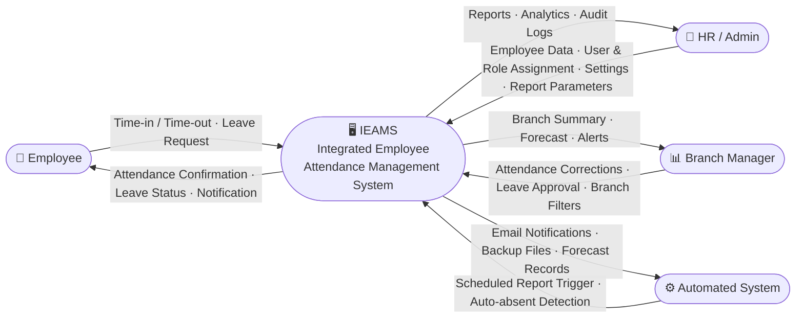
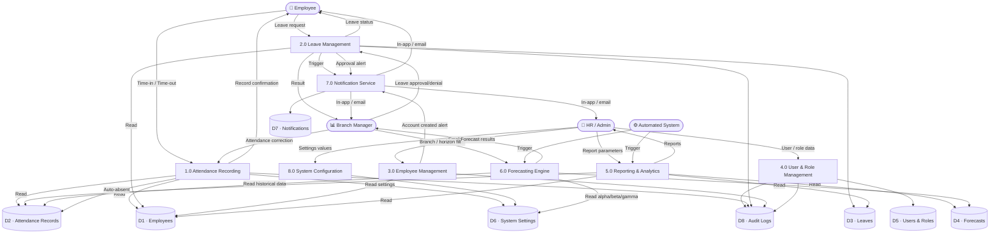

# IEAMS — Data Flow Diagram

Copy-paste each block into https://mermaid.live

---

## Level 0 — Context Diagram

---

## External Entities

| Entity | Description |
|---|---|
| **Employee** | Regular staff who record attendance and file leave requests |
| **HR / Admin** | Manages employees, users, settings, and generates reports |
| **Branch Manager** | Monitors branch attendance, approves leaves, views forecasts |
| **Automated System** | Scheduled jobs — auto-absent detection, report generation, backups |

---

## Level 0 — Context Diagram

Shows IEAMS as a single system and its data flows with all external actors.

---

## Level 1 — Detailed Data Flow Diagram

Expands IEAMS into 8 core processes with data stores and all data flows.

---

## Process Descriptions

### 1.0 — Attendance Recording
Handles employee time-in and time-out via the web interface. Computes hours worked, determines status (`present`, `late`, `absent`, `half_day`, `on_leave`). Supports manual corrections by HR/Branch Managers with audit logging. Also handles automated absent marking for employees with no record by end of day.

**Inputs:** Time-in/out from Employee, corrections from Branch Manager  
**Outputs:** Attendance confirmation, updated records  
**Data Stores Read:** D1 (Employees), D6 (Settings)  
**Data Stores Written:** D2 (Attendance Records), D8 (Audit Logs)

---

### 2.0 — Leave Management
Processes employee leave requests. Validates against leave balances. Routes approval requests to appropriate HR or Branch Manager. On approval, creates `on_leave` attendance records for the covered dates and deducts from the leave balance.

**Inputs:** Leave request from Employee, approval/denial from Branch Manager/HR  
**Outputs:** Leave status notification, updated attendance  
**Data Stores Read:** D1 (Employees), D3 (Leaves)  
**Data Stores Written:** D3 (Leaves), D2 (Attendance), D8 (Audit Logs)

---

### 3.0 — Employee Management
Manages the full employee lifecycle — creation, updates, and deactivation. Handles position, branch, and shift assignments. Optionally creates a linked user account with role assignment and emails credentials.

**Inputs:** Employee data from HR/Admin  
**Outputs:** Saved employee profile, account creation notification  
**Data Stores Written:** D1 (Employees), D8 (Audit Logs)

---

### 4.0 — User & Role Management
Manages system user accounts with Spatie Laravel Permission. Assigns roles (`admin`, `hr`, `branch_manager`, `employee`) which control access to all modules via route and controller-level permission checks.

**Inputs:** User data and role selection from Admin  
**Outputs:** User account, role assignment  
**Data Stores Written:** D5 (Users & Roles), D8 (Audit Logs)

---

### 5.0 — Reporting & Analytics
Generates configurable attendance reports (daily, monthly, date-range) filterable by branch, status, and employee. Computes analytics metrics: absenteeism rate, peak/low days, trend indicators. Supports export to CSV/Excel/PDF.

**Inputs:** Report parameters from HR/Admin  
**Outputs:** Reports and analytical insights  
**Data Stores Read:** D1, D2, D3, D4

---

### 6.0 — Forecasting Engine
Applies **Holt-Winters Triple Exponential Smoothing** (α = level, β = trend, γ = seasonality, period = 7 days) on 180 days of historical absence data per branch. Automatically falls back to **Moving Average** if fewer than 14 tracked days exist. Stores predictions per branch for up to 90 days ahead.

**Inputs:** Branch/horizon filter from Branch Manager or scheduler  
**Outputs:** Per-branch predicted absenteeism counts and rates  
**Data Stores Read:** D2 (Attendance Records), D6 (Settings — α, β, γ)  
**Data Stores Written:** D4 (Forecasts)

---

### 7.0 — Notification Service
Dispatches both in-app (database notifications) and email notifications. Triggered by leave events (submission, approval, denial), new user account creation, and attendance threshold alerts.

**Inputs:** Triggered by P2, P3  
**Outputs:** In-app notifications, emails to relevant actors  
**Data Stores Written:** D7 (Notifications)

---

### 8.0 — System Configuration
Manages global system settings: organization name, contact details, late/grace period thresholds, auto-absent hour limit, Holt-Winters smoothing parameters (α, β, γ), annual leave quotas per type, and alert email recipients.

**Inputs:** Settings values from Admin  
**Outputs:** Updated configuration applied system-wide  
**Data Stores Written:** D6 (System Settings)

---

## Data Stores

| ID | Name | Description |
|---|---|---|
| D1 | Employees | Employee profiles, positions, branch, shift, employment type |
| D2 | Attendance Records | Daily attendance per employee with status, time-in/out, hours worked |
| D3 | Leaves | Leave requests, type, dates, status, reviewer, leave balances |
| D4 | Forecasts | Holt-Winters/moving average predictions per branch per date |
| D5 | Users & Roles | System accounts, hashed passwords, Spatie roles and permissions |
| D6 | System Settings | Key-value configuration (thresholds, smoothing params, quotas) |
| D7 | Notifications | In-app notification records with read/unread state |
| D8 | Audit Logs | Spatie Activity Log entries for all model changes |

---

> **To export as PDF:** Open this file in VS Code → right-click → *Open Preview* → then print the preview (`Ctrl+P`) and choose *Save as PDF*.  
> Alternatively, open `data-flow-diagram.html` in a browser and press `Ctrl+P` → *Save as PDF*.
