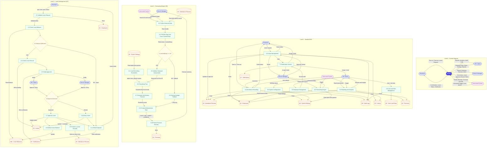

# IEAMS - Data Flow Diagram

Copy-paste into **https://mermaid.live**

```mermaid
flowchart TB

    subgraph CTX["Level 0 - Context Diagram"]
        direction LR
        C_EMP(["Employee"])
        C_HR(["HR / Admin"])
        C_BM(["Branch Manager"])
        C_AUTO(["Automated System"])
        C_SYS(["IEAMS"])

        C_EMP -->|"Time-in / Time-out, Leave Request"| C_SYS
        C_SYS -->|"Confirmation, Leave Status, Notification"| C_EMP
        C_HR -->|"Employee Data, Roles, Settings, Reports"| C_SYS
        C_SYS -->|"Reports, Analytics, Audit Logs"| C_HR
        C_BM -->|"Corrections, Leave Approval, Branch Filters"| C_SYS
        C_SYS -->|"Branch Summary, Forecast, Alerts"| C_BM
        C_AUTO -->|"Scheduled Trigger, Auto-absent"| C_SYS
        C_SYS -->|"Emails, Backups, Forecast Records"| C_AUTO
    end

    subgraph L1["Level 1 - Detailed DFD"]
        direction TB
        L_EMP(["Employee"])
        L_HR(["HR / Admin"])
        L_BM(["Branch Manager"])
        L_AUTO(["Automated System"])

        L_D1[("D1 - Employees")]
        L_D2[("D2 - Attendance Records")]
        L_D3[("D3 - Leaves")]
        L_D4[("D4 - Forecasts")]
        L_D5[("D5 - Users and Roles")]
        L_D6[("D6 - System Settings")]
        L_D7[("D7 - Notifications")]
        L_D8[("D8 - Audit Logs")]

        L_P1["1.0 Attendance Recording"]
        L_P2["2.0 Leave Management"]
        L_P3["3.0 Employee Management"]
        L_P4["4.0 User and Role Management"]
        L_P5["5.0 Reporting and Analytics"]
        L_P6["6.0 Forecasting Engine"]
        L_P7["7.0 Notification Service"]
        L_P8["8.0 System Configuration"]

        L_EMP -->|"Time-in / Time-out"| L_P1
        L_P1 -->|"Confirmation"| L_EMP
        L_EMP -->|"Leave request"| L_P2
        L_P2 -->|"Leave status"| L_EMP

        L_P1 --> L_D2
        L_P1 -->|"Read"| L_D1
        L_P1 -->|"Read settings"| L_D6
        L_P1 --> L_D8

        L_P2 --> L_D3
        L_P2 -->|"Read"| L_D1
        L_P2 -->|"Update on approval"| L_D2
        L_P2 --> L_D8
        L_P2 -->|"Alert"| L_P7

        L_HR -->|"Employee data"| L_P3
        L_HR -->|"User / role data"| L_P4
        L_HR -->|"Report parameters"| L_P5
        L_HR -->|"Settings values"| L_P8
        L_P5 -->|"Reports and Insights"| L_HR

        L_P3 --> L_D1
        L_P3 --> L_D8
        L_P3 -->|"Account alert"| L_P7
        L_P4 --> L_D5
        L_P4 --> L_D8

        L_P5 -->|"Read"| L_D1
        L_P5 -->|"Read"| L_D2
        L_P5 -->|"Read"| L_D3
        L_P5 -->|"Read"| L_D4
        L_P8 --> L_D6

        L_BM -->|"Correction"| L_P1
        L_BM -->|"Approval / denial"| L_P2
        L_P2 -->|"Result"| L_BM
        L_BM -->|"Branch and horizon"| L_P6
        L_P6 -->|"Forecast results"| L_BM

        L_P6 -->|"Read historical data"| L_D2
        L_P6 -->|"Read alpha beta gamma"| L_D6
        L_P6 --> L_D4

        L_AUTO -->|"Trigger"| L_P6
        L_AUTO -->|"Trigger"| L_P5
        L_AUTO -->|"Auto-absent"| L_P1

        L_P7 --> L_D7
        L_P7 -->|"In-app / email"| L_EMP
        L_P7 -->|"In-app / email"| L_HR
        L_P7 -->|"In-app / email"| L_BM
    end

    subgraph L2F["Level 2 - Forecasting Engine (P6)"]
        direction TB
        F_BM(["Branch Manager"])
        F_AUTO(["Automated System"])

        F_D2[("D2 - Attendance Records")]
        F_D4[("D4 - Forecasts")]
        F_D6[("D6 - System Settings")]

        F_P1["6.1 Load Smoothing Parameters"]
        F_P2["6.2 Collect Historical Data"]
        F_P3["6.3 Fill Date Gaps and Count Tracked Days"]
        F_P4{"6.4 trackedDays >= 14?"}
        F_P5["6.5 Initialise Seasonal Components"]
        F_P6["6.6 Smoothing Pass"]
        F_P7["6.7 Generate Holt-Winters Forecast"]
        F_P8["6.8 Moving Average Fallback"]
        F_P9["6.9 Compute Absenteeism Rate"]
        F_P10["6.10 Persist Forecast Records"]

        F_BM -->|"Branch ID and horizon"| F_P2
        F_AUTO -->|"Scheduled trigger"| F_P2
        F_D6 -->|"Read alpha beta gamma"| F_P1
        F_P1 -->|"alpha, beta, gamma values"| F_P6
        F_D2 -->|"Raw daily absent counts"| F_P2
        F_P2 -->|"Raw records"| F_P3
        F_P3 -->|"Filled series + trackedDays"| F_P4
        F_P4 -->|"YES"| F_P5
        F_P4 -->|"NO - fallback"| F_P8
        F_P5 -->|"Seasonal init S0 to S6"| F_P6
        F_P6 -->|"Smoothed level and trend"| F_P7
        F_P7 -->|"Predicted counts"| F_P9
        F_P8 -->|"7-day avg"| F_P9
        F_P9 -->|"count + rate + model + confidence"| F_P10
        F_P10 -->|"Write"| F_D4
        F_P10 -->|"Forecast summary"| F_BM
    end

    subgraph L2L["Level 2 - Leave Management (P2)"]
        direction TB
        V_EMP(["Employee"])
        V_HR(["HR / Admin"])
        V_BM(["Branch Manager"])

        V_D1[("D1 - Employees")]
        V_D2[("D2 - Attendance Records")]
        V_D3[("D3 - Leaves")]
        V_D3B[("D3b - Leave Balances")]
        V_D7[("D7 - Notifications")]

        V_P1["2.1 Validate Leave Request"]
        V_P2["2.2 Check Leave Balance"]
        V_P3{"2.3 Balance Sufficient?"}
        V_P4["2.4 Create Leave Record"]
        V_P5["2.5 Notify Approvers"]
        V_P6{"2.6 Approval Decision"}
        V_P7["2.7 Approve Leave"]
        V_P8["2.8 Deduct Leave Balance"]
        V_P9["2.9 Create on_leave Records"]
        V_P10["2.10 Deny Leave"]
        V_P11["2.11 Notify Employee"]

        V_EMP -->|"type, start, end, reason"| V_P1
        V_P1 -->|"Validated data"| V_P2
        V_P1 -->|"Read"| V_D1
        V_P2 -->|"Read balance"| V_D3B
        V_P2 --> V_P3
        V_P3 -->|"YES"| V_P4
        V_P3 -->|"NO - reject"| V_P11
        V_P4 -->|"Write pending"| V_D3
        V_P4 --> V_P5
        V_P5 -->|"Write notification"| V_D7
        V_P5 -->|"Notify"| V_HR
        V_P5 -->|"Notify"| V_BM
        V_HR -->|"Approve / Deny"| V_P6
        V_BM -->|"Approve / Deny"| V_P6
        V_P6 -->|"Approved"| V_P7
        V_P6 -->|"Denied"| V_P10
        V_P7 -->|"Update status"| V_D3
        V_P7 --> V_P8
        V_P7 --> V_P9
        V_P8 -->|"Update"| V_D3B
        V_P9 -->|"Write on_leave rows"| V_D2
        V_P10 -->|"Update + comment"| V_D3
        V_P10 --> V_P11
        V_P7 --> V_P11
        V_P11 -->|"Leave result"| V_EMP
        V_P11 -->|"Write notification"| V_D7
    end

    classDef entity    fill:#e0e7ff,stroke:#6366f1,color:#1e1b4b
    classDef process   fill:#f0fdf4,stroke:#16a34a,color:#14532d
    classDef datastore fill:#fff7ed,stroke:#ea580c,color:#7c2d12
    classDef auto      fill:#fdf2f8,stroke:#d946ef,color:#701a75
    classDef decision  fill:#fefce8,stroke:#ca8a04,color:#713f12
    classDef system    fill:#4f46e5,color:#fff,stroke:#3730a3

    class C_EMP,C_HR,C_BM,L_EMP,L_HR,L_BM,F_BM,V_EMP,V_HR,V_BM entity
    class C_AUTO,L_AUTO,F_AUTO auto
    class C_SYS system
    class L_P1,L_P2,L_P3,L_P4,L_P5,L_P6,L_P7,L_P8 process
    class F_P1,F_P2,F_P3,F_P5,F_P6,F_P7,F_P8,F_P9,F_P10 process
    class V_P1,V_P2,V_P4,V_P5,V_P7,V_P8,V_P9,V_P10,V_P11 process
    class F_P4,V_P3,V_P6 decision
    class L_D1,L_D2,L_D3,L_D4,L_D5,L_D6,L_D7,L_D8 datastore
    class F_D2,F_D4,F_D6 datastore
    class V_D1,V_D2,V_D3,V_D3B,V_D7 datastore
```
