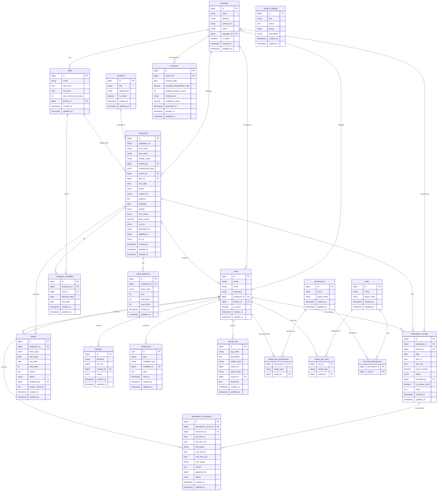

# IEAMS - Entity Relationship Diagram

Copy-paste into **https://mermaid.live**

```mermaid
erDiagram

    branches {
        bigint id PK
        string name
        string address
        string contact_no
        string email
        bigint manager_id FK
        boolean is_active
        timestamp created_at
        timestamp updated_at
    }

    positions {
        bigint id PK
        string title
        string department
        boolean is_active
        timestamp created_at
        timestamp updated_at
    }

    shifts {
        bigint id PK
        string name
        time start_time
        time end_time
        int late_threshold_minutes
        bigint branch_id FK
        timestamp created_at
        timestamp updated_at
    }

    users {
        bigint id PK
        string name
        string email
        string password
        bigint employee_id FK
        bigint branch_id FK
        boolean is_active
        timestamp created_at
        timestamp updated_at
    }

    employees {
        bigint id PK
        string employee_no
        string first_name
        string last_name
        string middle_name
        bigint position_id FK
        enum employment_type
        bigint branch_id FK
        bigint shift_id FK
        date hire_date
        enum status
        string contact_no
        text address
        date birthdate
        enum gender
        enum civil_status
        decimal basic_salary
        string sss_no
        string philhealth_no
        string pagibig_no
        string tin_no
        timestamp created_at
        timestamp updated_at
        timestamp deleted_at
    }

    employee_schedules {
        bigint id PK
        bigint employee_id FK
        bigint shift_id FK
        date effective_date
        date end_date
        timestamp created_at
        timestamp updated_at
    }

    attendance_records {
        bigint id PK
        bigint employee_id FK
        bigint branch_id FK
        date date
        time time_in
        time time_out
        decimal hours_worked
        enum status
        bigint recorded_by FK
        boolean is_manual_entry
        text notes
        timestamp created_at
        timestamp updated_at
    }

    attendance_corrections {
        bigint id PK
        bigint attendance_record_id FK
        bigint corrected_by FK
        time old_time_in
        time old_time_out
        string old_status
        time new_time_in
        time new_time_out
        string new_status
        text reason
        bigint approved_by
        enum status
        timestamp created_at
        timestamp updated_at
    }

    leaves {
        bigint id PK
        bigint employee_id FK
        enum leave_type
        date start_date
        date end_date
        int total_days
        text reason
        enum status
        bigint reviewed_by FK
        text review_comment
        timestamp created_at
        timestamp updated_at
    }

    leave_balances {
        bigint id PK
        bigint employee_id FK
        enum leave_type
        int year
        int total_days
        int used_days
        timestamp created_at
        timestamp updated_at
    }

    forecasts {
        bigint id PK
        bigint branch_id FK
        date forecast_date
        decimal predicted_absenteeism_rate
        int predicted_absent_count
        string model_used
        decimal confidence_level
        timestamp generated_at
        timestamp created_at
        timestamp updated_at
    }

    system_settings {
        bigint id PK
        string key
        text value
        string group
        string description
        timestamp created_at
        timestamp updated_at
    }

    backups {
        bigint id PK
        string filename
        bigint size_kb
        bigint created_by FK
        enum status
        timestamp created_at
        timestamp updated_at
    }

    notifications {
        uuid id PK
        string type
        string notifiable_type
        bigint notifiable_id FK
        text data
        timestamp read_at
        timestamp created_at
        timestamp updated_at
    }

    activity_log {
        bigint id PK
        string log_name
        text description
        string subject_type
        bigint subject_id
        string causer_type
        bigint causer_id FK
        json properties
        timestamp created_at
        timestamp updated_at
    }

    permissions {
        bigint id PK
        string name
        string guard_name
        timestamp created_at
        timestamp updated_at
    }

    roles {
        bigint id PK
        string name
        string guard_name
        timestamp created_at
        timestamp updated_at
    }

    model_has_permissions {
        bigint permission_id FK
        string model_type
        bigint model_id FK
    }

    model_has_roles {
        bigint role_id FK
        string model_type
        bigint model_id FK
    }

    role_has_permissions {
        bigint permission_id FK
        bigint role_id FK
    }

    %% --- Branch relationships ---
    branches }o--|| users : "manager"
    branches ||--o{ shifts : "has"
    branches ||--o{ employees : "employs"
    branches ||--o{ attendance_records : "recorded at"
    branches ||--o{ forecasts : "forecasted for"
    branches ||--o{ users : "assigned to"

    %% --- Position relationships ---
    positions ||--o{ employees : "assigned to"

    %% --- Shift relationships ---
    shifts ||--o{ employees : "default shift"
    shifts ||--o{ employee_schedules : "used in"

    %% --- Employee relationships ---
    employees |o--o| users : "linked to"
    employees ||--o{ employee_schedules : "has"
    employees ||--o{ attendance_records : "has"
    employees ||--o{ leaves : "requests"
    employees ||--o{ leave_balances : "has"

    %% --- Attendance relationships ---
    attendance_records ||--o{ attendance_corrections : "corrected via"
    users ||--o{ attendance_records : "recorded by"
    users ||--o{ attendance_corrections : "corrects"

    %% --- Leave relationships ---
    users ||--o{ leaves : "reviews"

    %% --- Backup relationships ---
    users ||--o{ backups : "creates"

    %% --- Notification relationships ---
    users ||--o{ notifications : "receives"

    %% --- Audit log relationships ---
    users ||--o{ activity_log : "causes"

    %% --- Role / Permission relationships ---
    roles ||--o{ model_has_roles : "assigned via"
    roles ||--o{ role_has_permissions : "has"
    permissions ||--o{ model_has_permissions : "granted via"
    permissions ||--o{ role_has_permissions : "included in"
    users ||--o{ model_has_roles : "has role"
    users ||--o{ model_has_permissions : "has permission"
```
