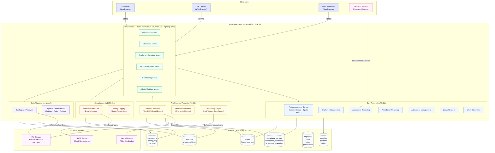

# IEAMS - System Solution Diagram

Copy-paste into **https://mermaid.live**

```mermaid
flowchart TB

    subgraph CLIENT["Client Layer"]
        direction LR
        EMP["Employee\n(Web Browser)"]
        HR["HR / Admin\n(Web Browser)"]
        BM["Branch Manager\n(Web Browser)"]
        BIO["Biometric Device\n(Fingerprint Scanner)"]
    end

    subgraph APP["Application Layer — Laravel 12 / PHP 8.2"]
        direction TB

        subgraph FE["Presentation — Blade Templates + Tailwind CSS + Alpine.js (Vite)"]
            direction LR
            V1["Login / Dashboard"]
            V2["Attendance Views"]
            V3["Employee / Schedule Views"]
            V4["Reports / Analytics Views"]
            V5["Forecasting Views"]
            V6["Admin / Settings Views"]
        end

        subgraph CORE["Core Processing Module"]
            direction LR
            M1["Auth and Access Control\n(Laravel Breeze + Spatie RBAC)"]
            M2["Employee Management"]
            M3["Attendance Recording"]
            M4["Attendance Monitoring"]
            M5["Attendance Management"]
            M13["Leave Request"]
            M14["Work Schedules"]
        end

        subgraph ANALYTICS["Analytics and Reporting Module"]
            direction LR
            M6["Report Generation\n(DomPDF / Excel Export)"]
            M7["Attendance Analytics\n(Charts via Chart.js)"]
            M8["Forecasting Engine\n(Holt-Winters Time Series)"]
        end

        subgraph SECURITY["Security and Audit Module"]
            direction LR
            M9["Notification and Alert\n(Email + In-App)"]
            M10["Activity Logging\n(Spatie Activity Log)"]
        end

        subgraph INFRA["Data Management Module"]
            direction LR
            M11["Backup and Recovery"]
            M12["System Administration\n(Settings / Roles / Policies)"]
        end

        FE --> CORE
        FE --> ANALYTICS
        FE --> SECURITY
        FE --> INFRA
    end

    subgraph DB["Database Layer — MySQL"]
        direction LR
        DB1[("branches\npositions\nshifts")]
        DB2[("employees\nusers\nroles\npermissions")]
        DB3[("attendance_records\nattendance_corrections\nemployee_schedules")]
        DB4[("leaves\nleave_balances")]
        DB5[("forecasts\nsystem_settings")]
        DB6[("notifications\nactivity_log\nbackups")]
    end

    subgraph EXT["External Services"]
        direction LR
        SMTP["SMTP Server\n(Email Notifications)"]
        QUEUE["Laravel Queue\n(Scheduled Jobs)"]
        FILES["File Storage\n(PDF / Excel / SQL Backups)"]
    end

    EMP -->|HTTPS| FE
    HR -->|HTTPS| FE
    BM -->|HTTPS| FE
    BIO -->|Time-in / Time-out input| M3

    CORE --> DB1
    CORE --> DB2
    CORE --> DB3
    CORE --> DB4
    ANALYTICS --> DB3
    ANALYTICS --> DB4
    ANALYTICS --> DB5
    SECURITY --> DB6
    INFRA --> DB5
    INFRA --> DB6

    M9 -->|Send email alerts| SMTP
    M8 -->|Scheduled forecast runs| QUEUE
    M11 -->|Write backup files| FILES
    M6 -->|Export files| FILES

    classDef userNode  fill:#e0e7ff,stroke:#6366f1,color:#1e1b4b
    classDef bioNode   fill:#fdf2f8,stroke:#d946ef,color:#701a75
    classDef feNode    fill:#f0fdf4,stroke:#16a34a,color:#14532d
    classDef coreNode  fill:#eff6ff,stroke:#3b82f6,color:#1e3a5f
    classDef repNode   fill:#fefce8,stroke:#ca8a04,color:#713f12
    classDef secNode   fill:#fff7ed,stroke:#ea580c,color:#7c2d12
    classDef infraNode fill:#f5f3ff,stroke:#7c3aed,color:#2e1065
    classDef dbNode    fill:#f8fafc,stroke:#475569,color:#0f172a
    classDef extNode   fill:#fdf4ff,stroke:#a855f7,color:#4a044e

    class EMP,HR,BM userNode
    class BIO bioNode
    class V1,V2,V3,V4,V5,V6 feNode
    class M1,M2,M3,M4,M5,M13,M14 coreNode
    class M6,M7,M8 repNode
    class M9,M10 secNode
    class M11,M12 infraNode
    class DB1,DB2,DB3,DB4,DB5,DB6 dbNode
    class SMTP,QUEUE,FILES extNode
```
